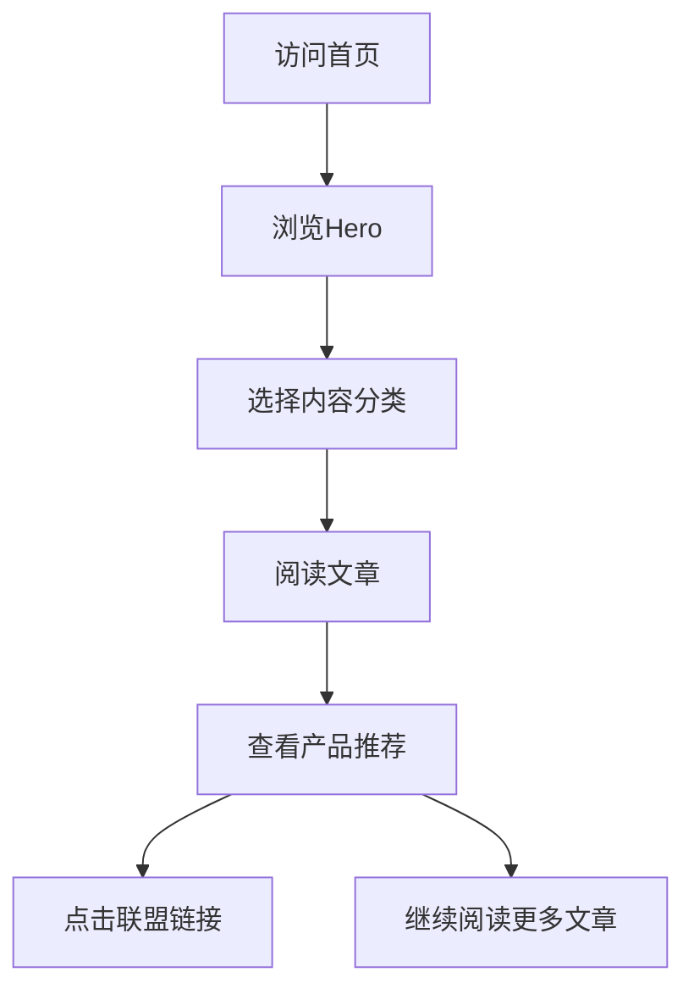

# 产品需求文档 (PRD)

## 1. 产品概述

**养生生活方式平台** - 一个专注于健康生活方式的PC端内容网站，帮助用户实现减脂、睡眠改善、冥想、补剂选择、中老年健康管理和职场减压。

- **核心价值**：提供高质量的健康生活方式内容，通过联盟营销和付费咨询实现变现
- **目标用户**：25-55岁的职场人群，关注健康但缺乏专业指导
- **变现模式**：补剂/器械联盟链接 + 广告投放 + 付费咨询/课程

## 2. 核心功能模块

### 2.1 用户角色
| 角色 | 访问权限 | 核心功能 |
|------|---------|---------|
| 访客 | 浏览所有免费内容 | 阅读文章、查看产品推荐 |
| 订阅用户 | 解锁深度内容和课程 | 完整课程、专家咨询 |

### 2.2 功能模块列表
1. **首页**：Hero区域 + 六大内容分类入口 + 最新文章列表
2. **内容分类页**：减脂、睡眠改善、冥想、补剂、中老年健康、职场减压
3. **文章详情页**：文章内容 + 相关推荐 + 产品联盟链接
4. **关于我们**：平台介绍、专家团队、合作咨询

### 2.3 页面详情
| 页面名称 | 模块名称 | 功能描述 |
|---------|---------|---------|
| 首页 | Hero区域 | 大标语 + 价值主张 + CTA按钮，自动轮播背景 |
| 首页 | 内容分类入口 | 六大健康分类卡片，带图标和简介 |
| 首页 | 精选文章 | 热门文章列表，支持分类筛选 |
| 内容分类页 | 文章列表 | 带分页的文章列表，支持筛选和排序 |
| 文章详情页 | 文章内容 | Markdown渲染，支持图片和视频 |
| 文章详情页 | 产品推荐 | 联盟产品卡片，可点击跳转购买 |
| 文章详情页 | 相关推荐 | 同分类下的其他文章 |
| 关于我们 | 团队介绍 | 专家团队展示和资质说明 |

## 3. 核心流程

### 3.1 用户浏览流程
```
首页 → 选择分类 → 阅读文章 → 查看产品推荐 → 点击联盟链接
```

### 3.2 流程图


## 4. 用户界面设计

### 4.1 设计风格
- **主题**：自然、活力、专业 - 采用有机绿色和温暖中性色调
- **风格**：现代简约，大量留白，内容为主
- **布局**：卡片式布局，清晰的视觉层级

### 4.2 色彩方案
- **主色**：#10B981 (翡翠绿 - 代表健康、自然)
- **辅助色**：#059669 (深绿)、#34D399 (浅绿)
- **强调色**：#F59E0B (琥珀色 - CTA按钮、重点标注)
- **背景色**：#FAFAFA (浅灰白)、#FFFFFF (纯白卡片)
- **文字色**：#1F2937 (深灰)、#6B7280 (中灰)

### 4.3 字体排版
- **标题字体**：Noto Serif SC (优雅、有品质感)
- **正文字体**：Noto Sans SC (清晰易读)
- **字号层级**：
  - H1: 48px/56px
  - H2: 36px/44px
  - H3: 24px/32px
  - Body: 16px/24px
  - Caption: 14px/20px

### 4.4 页面设计
| 页面名称 | 模块名称 | UI元素 |
|---------|---------|-------|
| 首页 | Hero区域 | 全宽渐变背景，中心文字，白色大按钮 |
| 首页 | 分类卡片 | 圆角卡片，悬停上浮，图标+标题+简介 |
| 首页 | 文章列表 | 图片+标题+摘要+标签，卡片式布局 |
| 分类页 | 文章卡片 | 同首页文章列表样式，增加筛选器 |
| 文章详情页 | 文章主体 | 最大宽度800px，段落间距适中 |
| 文章详情页 | 产品卡片 | 侧边固定，产品图+名称+价格+购买按钮 |

### 4.5 响应式设计
- **桌面优先**：1200px设计宽度
- **平板适配**：768px-1200px 保持单栏
- **移动端**：<768px 调整布局，增大触摸区域

## 5. 技术架构

### 5.1 技术栈
- **前端框架**：Vue 3.5 + TypeScript
- **构建工具**：Vite 8
- **路由管理**：Vue Router 5
- **状态管理**：Pinia 3
- **样式方案**：Tailwind CSS
- **部署平台**：Vercel

### 5.2 项目结构
```
src/
├── components/      # 可复用组件
├── views/          # 页面视图
├── router/         # 路由配置
├── stores/         # 状态管理
├── composables/    # 可组合函数
├── utils/          # 工具函数
└── assets/         # 静态资源
```

### 5.3 路由定义
| 路由路径 | 页面名称 | 功能描述 |
|---------|---------|---------|
| / | 首页 | Hero + 分类入口 + 文章列表 |
| /category/:slug | 分类页 | 特定分类的文章列表 |
| /article/:id | 文章详情 | 文章内容和产品推荐 |
| /about | 关于我们 | 平台介绍和团队展示 |

## 6. 内容策略

### 6.1 六大内容分类
1. **减脂** - 科学减脂方法、饮食建议、运动计划
2. **睡眠改善** - 睡眠卫生、失眠解决方案、睡眠追踪
3. **冥想** - 入门指南、正念练习、减压技巧
4. **补剂** - 产品评测、成分分析、购买指南
5. **中老年健康** - 慢病管理、骨骼健康、营养需求
6. **职场减压** - 工作生活平衡、职业倦怠、放松技巧

### 6.2 变现组件
- **联盟链接**：Amazon、淘宝健康类产品的推广链接
- **广告位**：Google AdSense 健康类广告
- **付费内容**：专家咨询、定制化健康计划

## 7. 合规要求

### 7.1 医疗健康声明
- 避免医疗诊断声明
- 使用"可能有助于"、"研究表明"等词汇
- 添加免责声明："本内容仅供参考，不构成医疗建议"

### 7.2 广告合规
- 明确标注广告内容
- 联盟链接使用 rel="sponsored"
- 遵守当地广告法规
