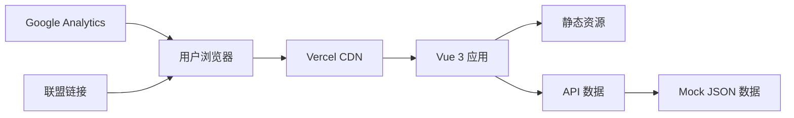

# 技术架构文档

## 1. 架构设计

### 1.1 整体架构


### 1.2 前端架构
```
┌─────────────────────────────────────────┐
│              表现层 (UI)                 │
│  Vue 3 + Tailwind CSS + Lucide Icons   │
└─────────────┬───────────────────────────┘
              │
┌─────────────▼───────────────────────────┐
│            业务层 (Logic)                │
│    Vue Router 5 + Pinia 3 状态管理     │
└─────────────┬───────────────────────────┘
              │
┌─────────────▼───────────────────────────┐
│            数据层 (Data)                 │
│      Mock JSON + LocalStorage          │
└─────────────────────────────────────────┘
```

## 2. 技术选型详情

### 2.1 核心技术
- **框架**：Vue 3.5 (Composition API)
- **语言**：TypeScript 6
- **构建**：Vite 8
- **路由**：Vue Router 5
- **状态**：Pinia 3
- **样式**：Tailwind CSS 3
- **图标**：Lucide Vue

### 2.2 辅助工具
- **开发服务器**：Vite 内置
- **类型检查**：vue-tsc
- **代码规范**：ESLint + Prettier
- **部署**：Vercel CLI

### 2.3 依赖包
```json
{
  "dependencies": {
    "vue": "^3.5.32",
    "vue-router": "^5.0.4",
    "pinia": "^3.0.4",
    "lucide-vue-next": "latest"
  },
  "devDependencies": {
    "tailwindcss": "^3.4.0",
    "autoprefixer": "^10.4.0",
    "postcss": "^8.4.0",
    "@vitejs/plugin-vue": "^6.0.6",
    "vite": "^8.0.8",
    "typescript": "~6.0.0",
    "vue-tsc": "^3.2.6"
  }
}
```

## 3. 路由定义

### 3.1 路由表
| 路由路径 | 组件 | 页面标题 | 权限 |
|---------|------|---------|------|
| / | HomeView | 首页 | 公开 |
| /category/:slug | CategoryView | 内容分类 | 公开 |
| /article/:id | ArticleView | 文章详情 | 公开 |
| /about | AboutView | 关于我们 | 公开 |

### 3.2 路由参数
```typescript
// 分类路由参数
interface CategoryParams {
  slug: 'fat-loss' | 'sleep' | 'meditation' | 'supplements' | 'elderly' | 'workplace'
}

// 文章路由参数
interface ArticleParams {
  id: string
}
```

## 4. 组件架构

### 4.1 组件层级
```
App.vue (根组件)
├── NavBar.vue (导航栏)
├── RouterView
│   ├── HomeView
│   │   ├── HeroSection
│   │   ├── CategoryGrid
│   │   └── ArticleList
│   ├── CategoryView
│   │   ├── CategoryHeader
│   │   └── ArticleGrid
│   ├── ArticleView
│   │   ├── ArticleContent
│   │   ├── ProductRecommendation
│   │   └── RelatedArticles
│   └── AboutView
│       └── TeamSection
└── Footer.vue (页脚)
```

### 4.2 核心组件
| 组件名称 | 职责 | 复用性 |
|---------|------|--------|
| NavBar | 全局导航和SEO | 全局 |
| Footer | 全局页脚和链接 | 全局 |
| HeroSection | 首页大标语区域 | 首页专用 |
| CategoryCard | 分类卡片展示 | 多个页面 |
| ArticleCard | 文章卡片展示 | 多个页面 |
| ProductCard | 产品推荐卡片 | 文章详情 |

## 5. 数据模型

### 5.1 数据类型定义
```typescript
// 文章数据
interface Article {
  id: string
  title: string
  slug: string
  category: string
  summary: string
  content: string
  coverImage: string
  author: string
  publishDate: string
  tags: string[]
  readTime: number
  products?: Product[]
}

// 产品推荐
interface Product {
  id: string
  name: string
  price: number
  affiliateUrl: string
  image: string
  description: string
}

// 分类
interface Category {
  slug: string
  name: string
  icon: string
  description: string
  color: string
}
```

### 5.2 Mock 数据存储
```typescript
// src/data/articles.ts
// src/data/categories.ts
// src/data/products.ts
```

## 6. 状态管理

### 6.1 Pinia Store 结构
```typescript
// stores/article.ts
export const useArticleStore = defineStore('article', {
  state: () => ({
    articles: [],
    currentArticle: null,
    loading: false
  }),
  actions: {
    fetchArticles(),
    fetchArticleById(id),
    filterByCategory(category)
  }
})

// stores/category.ts
export const useCategoryStore = defineStore('category', {
  state: () => ({
    categories: []
  })
})
```

## 7. 部署配置

### 7.1 Vercel 部署
- **框架**：Vue.js (Vue CLI)
- **构建命令**：npm run build
- **输出目录**：dist
- **Node 版本**：20.x

### 7.2 环境变量
```env
VITE_API_BASE_URL=/api
VITE_GA_ID=G-XXXXXXXXXX
```

### 7.3 Vercel 配置文件
```json
{
  "buildCommand": "npm run build",
  "outputDirectory": "dist",
  "framework": "vue",
  "nodeVersion": "20"
}
```

## 8. 性能优化

### 8.1 前端优化
- 图片懒加载
- 路由懒加载
- 组件按需引入
- CSS 压缩和优化

### 8.2 加载策略
- 首屏关键资源优先加载
- 非关键资源延迟加载
- 图片使用 WebP 格式

## 9. SEO 配置

### 9.1 Meta 标签
```typescript
const defaultMeta = {
  title: '养生生活方式 - 健康减脂、睡眠改善、冥想指南',
  description: '专业的健康生活方式平台，提供减脂、睡眠改善、冥想、补剂选择等科学健康内容。',
  keywords: '减脂,睡眠改善,冥想,补剂,健康生活,中老年健康'
}
```

### 9.2 结构化数据
- 使用 JSON-LD 格式
- 添加 Article 和 BreadcrumbList schema

## 10. 安全考虑

### 10.1 联盟链接安全
- 所有联盟链接添加 `rel="sponsored noopener"`
- 使用 URL 参数追踪点击
- 定期检查链接有效性

### 10.2 内容安全
- XSS 防护
- CSP 内容安全策略
- 外部链接安全警告
